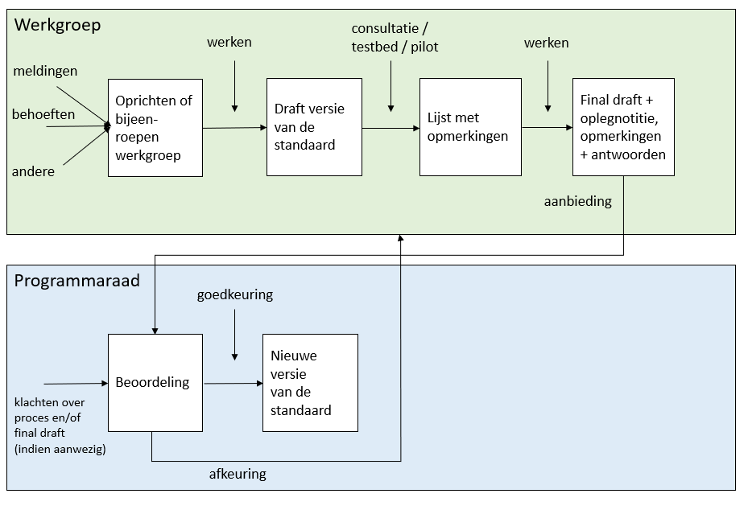

## Operationeel

**De dynamiek van het werkveld zal soms een aanpassing van de basis geo-standaarden vereisen. Hoe deze dagelijkse praktijk van het beheer van de standaard wordt uitgevoerd is, op basis van de structuur in voorgaand hoofdstuk, in dit hoofdstuk nader beschreven.**

### Algemeen

De basis geo-standaarden publiceren wij op onze [website](https://www.geonovum.nl) , samen met aanvullende informatie over inhoud, toepassing en meldingen gerubriceerd per onderwerp. Ook informatie over bijvoorbeeld bijeenkomsten, de werkgroepen en andere documentatie is hier te vinden. Algemene informatie over de geo-standaarden is samen gebracht op de website onder het onderwerp ‘Geo-standaarden’.

### Standaarden in gebruik

Het gebruik van standaarden gaat niet vanzelf. Ondanks verschillende publicaties en informatie via de Geonovum website, kunnen vragen ontstaan over de toepassing van de standaard of fouten ontdekt worden. Niet in de laatste plaats heeft de praktijk juist wel voorstellen tot verbetering van de standaard. Deze praktijkervaring kan aanleiding zijn tot de verdere ontwikkeling van een standaard. 
Vragen, wensen tot wijziging en gevonden fouten kunnen altijd gemeld worden via de helpdesk (Geonovum heeft verschillende contact adressen, zie voor een [overzicht](http://www.geonovum.nl/contact/helpdesk) de Geonovum website. Voor alle basis geo-standaarden kan contact met ons worden opgenomen via geostandaarden@geonovum.nl of stel je vraag op het [Geoforum](https://geoforum.nl/)). Daarnaast kan met behulp van een meldingen formulier een wijzigingsverzoek voor de standaard worden ingediend. Voor GML en GeoPackage is dit bij het [OGC](http://ogc.standardstracker.org/). Per, bij Geonovum in beheer zijnde standaard, is een lijst van meldingen inzichtelijk. 

**Helpdesk** 

Na ontvangst van de vraag bij de helpdesk Geo-standaarden ontvangt de vraagsteller van Geonovum een ontvangstbevestiging. De helpdeskmedewerker kent aan de melding een actiehouder toe.

**Registratie en publicatie** 

Alle bij de helpdesk binnen gekomen vragen, dan wel wensen of fouten, worden geregistreerd in het helpdesk systeem. Wanneer blijkt dat een vraag/ melding een wijzigingsverzoek is, dan wordt deze opgenomen in de meldingenlijst die per standaard via de Geonovum website inzichtelijk is. In de lijst is voor iedereen te zien wat de status van de melding is en of deze wordt of is meegenomen in een volgende wijziging van de standaard. Een vraag over de standaard wordt niet aan de meldingenlijst toegevoegd maar afgehandeld via de helpdesk. 

**Meldingen formulier** 

Naast een overzicht van meldingen per standaard kan een gebruiker van een standaard ook per formulier een wens, eis of fout aan ons kenbaar maken. Iedere standaard heeft op de Geonovum hiervoor een formulier beschikbaar. Degene die een melding maakt, vult naast contactgegevens ook het voorstel tot wijziging met een toelichting daarop in. Het is ook mogelijk bestanden aan de melding toe te voegen.

###	(Door)ontwikkeling van de standaard

Voor inzicht in de ontwikkeling van de basis geo-standaarden zijn de [standaardenagenda](#standaardenagenda) en het [wijzigingsprotocol](#wijzigingsprotocol) beschikbaar. In de standaardenagenda is aangegeven wat de algehele actuele ontwikkelingen zijn op het gebied van de standaarden. In het wijzigingsprotocol is het wijzigingsproces van een standaard beschreven. De planning voor de uitvoering van het wijzigingsproces is terug te vinden in de standaardenagenda. Ontwikkelingen in de standaarden kunnen om verschillende redenen gewenst zijn, waaronder:
- geconstateerde fout in de standaard;
- wens tot wijziging, uitbreiding of vereenvoudiging uit de praktijk;
- aanpassing van de standaard door internationale ontwikkelingen.

In de aanloop naar een wijziging van de standaarden bundelt Geonovum de meldingen, verzoeken tot wijziging, in een wijzigingsvoorstel. Met behulp van onder andere een publieke consultatie (zie [toetsing](#toetsing)) leggen wij de wijziging voor aan de praktijk en vragen hun feedback. 

**Figuur Communicatie tijdens het ontwikkelproces**

### Inzicht in het wijzigingsproces

De meldingen en wijzigingsverzoeken alsook (inter)nationale ontwikkelingen geven aanleiding tot de verdere ontwikkeling voor een standaard. Zij worden gebundeld in een wijzigingsvoorstel. Het wijzigingsprotocol geeft richting aan het wijzigingsproces dat dit wijzigingsvoorstel doorloopt. In onderstaand figuur is het wijzigingsproces geschetst voor het vaststellen van een nieuwe (versie van een) standaard. De beschrijving geldt voor de type wijziging versie x en y (zie [versiebeheer](#versiebeheer)). De programmaraad beoordeelt en beslist over deze wijzigingsvoorstellen. Z-wijzigingen worden door Geonovum zelf uitgevoerd zonder tussenkomst van de programmaraad. 

**Figuur Proces vaststellen nieuwe standaard**

Dit figuur toont twee groepen: de werkgroep en de programmaraad. De werkgroep voert het wijzigingsvoorstel in de standaard door. Dit resulteert in een definitief concept van de nieuwe versie van de standaard. De programmaraad beoordeelt dit definitief concept. Keurt zij het goed, dan is er een nieuwe standaard. Keurt zij het af, dan gaat het concept terug naar de werkgroep. Na aanpassing wordt het opnieuw aan de programmaraad voorgelegd, net zo lang totdat de programmaraad de nieuwe versie van de standaard accordeert of de standaard teruggetrokken wordt.
Bij het vaststellen van een nieuwe versie van een standaard stelt de programmaraad met advies van Geonovum vast hoelang een oude versie wordt ondersteund en wanneer een oude versie komt te vervallen. Een uitzondering hierop is het Basismodel Geo-informatie (NEN 3610). Ook nieuwe versies van deze standaard bereidt Geonovum voor in samenwerking met werkgroepen. De programmaraad stelt de nieuwe versie niet vast, maar keurt hem goed (of af) en draagt deze vervolgens voor aan de NEN normcommissie 351 240 Geo-informatie. Deze commissie verzorgt de openbare consultatie en stelt de standaard formeel vast. 
De programmaraad beslist, op advies van Geonovum, of zij een vastgestelde standaard voordraagt voor opname op [de pas-toe-of-leg-uit-lijst voor open standaarden](https://www.forumstandaardisatie.nl/open-standaarden). Bij een positief besluit verzorgt Geonovum de voordracht bij het Forum Standaardisatie. Organisatorisch bestaat er geen formele relatie tussen de stuurgroep en het Forum Standaardisatie, inhoudelijk dus wel.

#### Toetsing

Er is een sterke afhankelijkheid tussen de toets van een wijzigingsvoorstel en de implementatie van de nieuwe standaard in de praktijk. Deze toets voeren wij uit in de vorm van publieke consultatie, pilots en testbeds. Zij zijn van primair belang voor het slagen van het wijzigingsproces en ingebruikname van de nieuwe (versie van de) standaard. Niet goed doordachte wijzigingen zullen het werkveld in grote problemen brengen. Het werkveld betrekken wij daarom nauw bij de uitvoering van de pilots en testbed. Welke actoren en werkgroepen betrokken zijn is aangegeven in het wijzigingsprotocol van de standaarden.

**Publieke consultatie** wordt ingezet voor het toetsen van een (nieuwe versie van de) standaard in praktijk. De (potentiele) gebruikers van de standaard worden door middel van nieuwsberichten en nieuwsbrieven geïnformeerd over de ter inzage liggende standaard. De standaard ligt minimaal 30 dagen ter inzage, doorgaans 6 weken of langer indien gewenst. Er kan gereageerd worden met behulp van een meldingen formulier of door een bericht te sturen aan de geo-standaarden helpdesk. 
Voor de standaarden die op de pas-toe-of-leg-uit lijst staan wordt een melding gemaakt bij het Forum Standaardisatie zodat het Forum Standaardisatie ook melding kan maken van de consultatie van deze standaarden. 

**Pilots** worden uitgevoerd bij een volledige nieuwe standaard. Op basis van een pilot wordt naast het werken met de standaard ook bijvoorbeeld toepassingsgebied, (on)mogelijkheden, behoeften, etc. onderzocht. Op basis van de uitkomst van een pilot wordt dan een beslissing genomen of en hoe met deze nieuwe standaard wordt verder gegaan.

**Testbeds** Afhankelijk van het moment in het wijzigingsproces kan een testbed worden uitgevoerd om:
-	kleine technische fouten die het werkveld heeft geconstateerd bij de implementatie op een gecontroleerde wijze te herstellen;
-	vast te stellen of de standaard in een productieomgeving implementeerbaar is.
Testbeds passen wij toe als onderdeel van de wijzigingsproces om de kwaliteit van de wijziging op implementatie te toetsen.

### Implementatie van de standaard

####	Soorten documenten

De volgende documentatie wordt onderkend en door Geonovum gebruikt in het beheer van de Geo-standaarden.

**Norm** Een norm is bij een officieel standaardisatie instituut ondergebracht en bevat bindende afspraken.
Naast het gebruik van normen is NEN 3610 de enige norm waar Geonovum een inhoudelijke verantwoordelijkheid heeft. Het formele beheer en beslissingen worden genomen in de NEN normcommissie 351 240 waar Geonovum de voorzitter van is.

**Standaard**  Een document met (bindende) afspraken.

**Informatiemodel**  Een standaard waarbij door de term informatiemodel te hanteren wordt aangegeven dat het een abstractie (het model) vormt van de werkelijkheid zoals beschreven binnen een bepaalde sector/domein. Informatiemodellen zijn een semantische invulling van normen voor sectoren zoals ruimtelijke ordening, kabels en leidingen, water, etc..

**Praktijkrichtlijn** Praktijkrichtlijnen zijn producten die informatie geven, vaak met een technisch karakter, die nodig is voor het toepassen van standaarden. Een praktijkrichtlijn hoort altijd bij een standaard/norm.

**Handreiking**  Op zichzelf staande documentatie dat als doel heeft een hulpmiddel te zijn, niet verplichtend maar ondersteunend.

**Werkafspraak**  Legt uit hoe wetgeving moet worden toegepast bij onduidelijkheden, discrepanties of fouten in de standaarden.

**Algemeen**  Op zichzelf staande algemene documentatie over standaarden. De documentatie betreft niet een specifieke standaard of onderdeel daarvan, het is ook geen beheerdocumentatie van een specifieke standaard.

**Beheerdocumentatie**   Documentatie met betrekking tot het beheerproces van de standaard. Deze documentatie betreft niet een standaard of onderdeel daarvan, zoals een handreiking of werkafspraak. Dit kan interne gerichte documentatie zijn voor vastleggen van stappen in het dagelijkse werkproces, planning of hoe de helpdesk werkt. Ook kan dit een beheerplan of handboek zijn. Als dit soort documentatie publiekelijk beschikbaar wordt gesteld, dan gebeurd dit door middel van ReSpec. 

####	Hulpmiddelen

Tot de documentatie behoren de standaarden zelf, maar bijvoorbeeld ook publicaties, verslagen en presentaties over de standaarden. Per standaard zijn verschillende hulpmiddelen beschikbaar. Naast de standaard zelf is voor de implementatie ondersteuning de Geonovum website ook de centrale toegang. 
Met betrekking tot implementatie ondersteuning is onder andere beschikbaar, dan wel vindbaar via de Geonovum website: 
-	Agenda, dan wel planning;
-	Helpdesk en veel gestelde vragen;
-	Informatie over eventuele werkgroepen;
-	Publicatie als ook presentaties, filmpjes, artikelen die de toepassing van de standaard toelichten;
-	Meldingen;
-	Validator voor de technische toets van data conform de standaard.

Voor iedere standaard is daarnaast, middels dit document en de website, aangegeven hoe het beheer van de standaard wordt gevoerd. Nieuwsberichten en nieuwsbrieven houden de gebruikers van de standaard op de hoogte van ontwikkelingen en activiteiten. Hoofdstuk [Implementatieondersteuning](#Implementatieondersteuning) geeft een nadere toelichting op implementatieondersteuning. 

