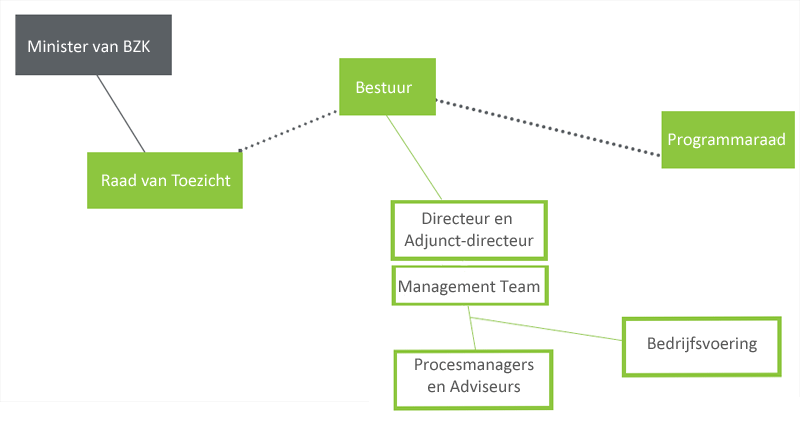

## Strategie

**Governance, visie en financiën zijn onderdelen van de strategie voor het beheer van de basis geo-standaarden.**

### Governance

Geonovum is een overheidsstichting met een onafhankelijk bestuur, een Raad van Toezicht en een programmaraad. De minister van BZK benoemt de leden van onze Raad van Toezicht. Onze missie, doelen, taken en jaarlijkse uitvoeringsplan staan op onze website (Zie: http://www.geonovum.nl/over-geonovum/waar-wij-voor-staan) .
De programmaraad adviseert het bestuur over de inhoud en prioriteiten voor het basisprogramma en over onze andere werkzaamheden. Voor het basisprogramma, het beheer van de geo-standaarden, treedt de programmaraad op als stuurgroep. De programmaraad beoordeelt en beslist over deze wijzigingsvoorstellen en stelt een nieuwe (versie) van de standaard vast van geo-standaarden die bij Geonovum in beheer zijn. Ook is de programmaraad aanspreekpunt voor klachten over het beheer van de standaarden door Geonovum. De programmaraad bestaat uit vertegenwoordigers van publieke organisaties in het geo-werkveld. Zij zijn de voornaamste belanghebbenden van Geonovum (Zie: http://www.geonovum.nl/over-geonovum/wie-wij-zijn/programmaraad).

De overheid beter laten presteren met geo-informatie. Dat is waar Geonovum dagelijks aan werkt. We doen dat door de uitwisseling van geo-informatie onderling en met andere soorten gegevens mogelijk te maken met standaarden. De ontwikkeling en beheer van de geo-standaarden is een basistaak van Geonovum en is belegd in ons basisprogramma. Jaarlijks adviseert de programmaraad aan het bestuur bindend over de inhoud van het basisprogramma. De Raad van Toezicht keurt het uitvoeringsplan, waarin het basisprogramma is opgenomen, goed voordat het bestuur het uitvoeringsplan vaststelt. Eenmaal per kwartaal rapporteert Geonovum aan de programmaraad en het bestuur over de voortgang in het basisprogramma.

Samenwerking met andere standaardisatieorganisaties is onderdeel van de governance (zie paragraaf (zie paragraaf [Internationale, Europese en nationale geo-standaardisatiegemeenschap](#internationale-europese-en-nationale-geo-standaardisatiegemeenschap) en paragraaf [Samenwerking met andere beheerorganisaties](#samenwerking-met-andere-beheerorganisaties)).
Mocht de beheertaak van Geonovum voor de basis geo-standaarden vervallen, dan zullen de intellectuele eigendomsrechten overgaan naar de nieuwe beheerder of bij gebrek daaraan aan het ministerie van Binnenlandse Zaken en Koninkrijksrelaties.

###	Visie

Dit is onze visie op het beheer van de basis geo-standaarden. Een standaard die niet in beheer is, is geen standaard. De standaarden die Geonovum in beheer heeft, zijn ingebed in nationale en internationale standaarden. Geonovum voert het beheer transparant uit in samenwerking met belanghebbende partijen.

### Financiën

Het beheer van de basis geo-standaarden is onderdeel van ons basisprogramma. Dit programma wordt gesubsidieerd door ministeries van Binnenlandse Zaken en Koninkrijksrelaties en Landbouw, Natuur en Voedselveiligheid, van het Kadaster en van de Geologische Dienst Nederland TNO. Jaarlijks wordt bepaald welk deel van de basisfinanciering besteed wordt aan het standaardisatiewerk en daarmee het beheer van de basis geo-standaarden. Over de besteding van de basisfinanciering leggen wij verantwoording af aan onze subsidieverleners en via het jaarverslag, inclusief jaarrekening voorzien van een goedkeurende accountantsverklaring.
