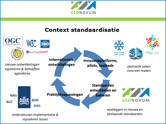

## Tactiek

**Iedereen die de basis geo-standaarden gebruikt, ongeacht waarom, willen wij voorzien van de juiste en actuele standaarden en van informatie over de toepassing ervan. Dit hoofdstuk beschrijft hoe wij de basis geo-standaarden ontwikkelen en op welke wijze beschikbaar stellen.**

### Architectuur

Architectuur richt zich op de samenhang tussen de standaarden onderling en op het uitzetten en toetsen van de inhoudelijke lijnen van de standaarden. Daarbij is het van belang de samenhang te bewaken tussen de inhoudelijke producten van het geo-werkveld en die van buiten het werkveld, zoals standaarden in aangrenzende domeinen. Overlap wordt hierdoor voorkomen. Bijzondere aandacht verdient de relatie met de internationale standaardisatiegemeenschap.

#### Internationale Europese en nationale geo-standaardisatiegemeenschap

Belangrijk uitgangspunt van Geonovum bij standaardisatie is de afstemming met internationale ontwikkelingen. Ontwikkelingen in standaarden op internationaal, Europees en nationaal niveau zijn van invloed op het beheer van de basis geo-standaarden. Geonovum zorgt ervoor dat nieuwe en veranderde internationale geo-standaarden, indien relevant en door Nederland ondersteund, geadopteerd en erkend worden in Nederland. 
Op onze website staat een overzicht van standaardisatieorganisaties op nationaal, Europees en internationaal niveau (Zie: http://www.geonovum.nl/onderwerpen/standaardisatie-nationaal-en-internationaal/algemeen-standaardisatie). Wij zijn op deze drie niveaus actief en daardoor op de hoogte van relevante ontwikkelingen.

Geonovum behartigt de Nederlandse belangen voor geo-standaarden door actieve participatie binnen de internationale standaardisatiefora ISO/TC 211 (Zie: http://www.isotc211.org ) , OGC (Zie: http://www.opengeospatial.org) en W3C (Zie: http://www.w3.org) . Deze standaardisatie organisaties maken technische geo-standaarden die Nederland semantisch invult. Geonovum is tevens betrokken bij de Europese richtlijn INSPIRE (Zie: http://inspire.jrc.ec.europa.eu/). 
Participatie bestaat onder andere uit deelname aan de werkgroepen, die standaarden ontwikkelen en aanpassen. Daarnaast volgen wij de ontwikkelingen bij en OMG (Zie: www.omg.org)  die zich bezighouden met standaarden voor het web en ICT. En op Europees niveau in CEN/TC 287 (Zie: http://standards.cen.eu/).
Geonovum is ook lid van het Forum Standaardisatie zodat een goede inbreng van de geo-standaarden naar de e-overheid en visa versa is geborgd. De voorbereidingen van de bijeenkomsten van ISO/TC 211 en CEN/TC 287 en stemmingen worden gedaan in de NEN normcommissie 351 240 Geo-informatie (Zie: http://www.geonovum.nl/onderwerpen/standaardisatie-nationaal-en-internationaal/nen-normcommissie). Geonovum is voorzitter van deze normcommissie die bestaat uit een representatieve afvaardiging van Nederlandse belanghebbende organisaties.
       |

### Samenwerking met andere beheerorganisaties

Geonovum werkt samen met andere standaardisatieorganisaties als zij te maken hebben met geo-informatie en er wederzijds behoefte aan samenwerking is. Hierbij kan onderscheid gemaakt worden in twee groepen, namelijk infrastructurele en thematische standaarden en hun organisaties.

<aside class='example'>

Voorbeelden van infrastructurele standaarden organisaties zijn ICTU (Zie: http://www.ictu.nl) en Logius (Zie: http://www.logius.nl). Zij ontwikkelen en beheren standaarden voor de e-overheid (Zie: http://www.e-overheid.nl). Geonovum borgt dat de basis geo-standaarden onderdeel zijn van de e-overheid. Voorbeelden van thematische standaarden zijn de informatiemodellen voor de ruimtelijke ordening of cultuurhistorie als uitwerking op het Basismodel Geo-informatie (NEN 3610), of de community standaarden voor bodemsanering en voor remote sensing, elk met een eigen beheerorganisatie.

</aside>

#### Raamwerk van geo-standaarden

Om inzicht te geven in de veelheid van standaarden voor geo-informatie heeft Geonovum het Raamwerk van geo-standaarden opgesteld (Zie: http://www.geonovum.nl/onderwerpen/geo-standaarden/raamwerk-van-geo-standaarden). Het Raamwerk benoemt de standaarden die voor Nederland binnen het geo-domein van toepassing zijn voor aansluiting met andere domeinen. Het sluit aan op de Europese infrastructuur en integreert het geo-domein met de elektronische overheid. Het Raamwerk geo-standaarden is een aanvulling op het NORA dossier geo-informatie  (zie paragraaf [Nederlandse Overheid Referentie Architectuur (NORA)](#nederlandse-overheid-referentie-architectuur-(nora))) (Zie: http://www.geonovum.nl/onderwerp-artikel/geo-nora). Het is geschreven voor iedereen die betrokken is bij het toepassen van standaarden voor geo-informatie. Zoals informatiemanagers, stuurgroepleden, beleidsmedewerkers, projectleiders, adviseurs, architecten, IT-leveranciers, en voor personen die standaarden en specificaties implementeren in hun organisatie en willen kunnen integreren met andere organisaties in Nederland en Europa.

#### Nederlandse Overheid Referentie Architectuur (NORA)

De Nederlandse Overheid Referentie Architectuur NORA (Zie: http://www.e-overheid.nl/onderwerpen/over-de-e-overheid/architectuur/nora-familie/nora) geeft algemene architectuurprincipes voor domeinarchitecturen, zoals voor het Rijk (MARIJ), provincies (PETRA) en gemeenten (GEMMA). Geo-informatie wordt gezien als een aspect van architectuur. Dit betekent dat geo-informatie niet domeingericht is, maar voor iedereen geldig is of kan zijn. Om deze reden is geo-informatie integraal opgenomen in NORA (Zie: http://www.geonovum.nl/sites/default/files/nora3.0.pdf en http://www.geonovum.nl/sites/default/files/nora_dossier_geo-informatie.pdf) vanaf versie 3.0. Het Forum Standaardisatie heeft NORA 3.0 in oktober 2010 goedgekeurd. Er is daarmee een aanvullend NORA dossier Geo-informatie beschikbaar gekomen (Zie: http://www.geonovum.nl/onderwerpen/geo-architectuur/geo-nora) . Het kennisplatform NORA online is uitgebreid, conform NORA 3.0, met het thema GEO (Zie: http://www.noraonline.nl/wiki/Geo).

###	Toekomstige ontwikkeling

Ontwikkelingen van de basis geo-standaarden in de toekomst maken wij inzichtelijk via de standaardenagenda (Zie: http://www.geonovum.nl/onderwerpen/geo-standaarden/beheer-geo-standaarden) en door transparant versiebeheer volgens wijzigingsprotocollen en wijzigingsbeheer.

#### Standaardenagenda

Met behulp van de standaardenagenda geven we inzicht in onze jaarlijkse werkzaamheden en activiteiten rondom de basis geo-standaarden. De standaardenagenda wordt jaarlijks vastgesteld door de programmaraad en gepubliceerd op de website van Geonovum. De standaardenagenda is een vertaling van requirements en ontwikkelingen vanuit het werkveld. Het werkpakket benoemd in de standaardenagenda is te herleiden naar de activiteiten voor ontwikkeling en beheer conform BOMOS.

####	Wijzigingsbeheer 

Belanghebbenden kunnen meldingen (wijzigingsverzoeken), variërend van wensen tot aanpassing van en fouten in een basis geo-standaard, indienen bij Geonovum (Een voorbeeld van een meldingen overzicht voor de geo-standaard Metadata: 
http://www.geonovum.nl/onderwerp-artikel/meldingen-metadata). Wij geven inzicht in de ontvangen meldingen en bundelen de verzoeken tot een wijzigingsvoorstel in het geval we een wijzigingsproces starten voor een nieuwe versie van de standaard. Het [Wijzigingsprotocol](#wijzigingsprotocol)) beschrijft het wijzigingsproces en daarmee ook de procedure die het wijzigingsvoorstel doorloopt. Via onze website geven wij per standaard een overzicht van de ingediende meldingen, met daarbij per melding de status. Zo is te volgen of een melding onderzocht wordt of meegenomen in het wijzigingsvoorstel. De meldingen worden op basis van onderstaand model via de website voor eenieder beschikbaar gesteld. Sommige meldingen slaan de status AFGEMELD over.

| Status   voorstel | Beschrijving activiteiten  |
|---|---|
| NIEUW             | Als een gebruiker een melding indient krijgt deze de status “nieuw”.  |
| TERUGKOPPELING    | De actiehouder van de melding controleert of de melding volledig en helder is. Bij een fout gaat hij/zij in de standaard na of dit inderdaad het geval is. Hij/zij kan informatie opvragen of een onderzoek uitvoeren.      |
| ERKEND            | Deze melding is helder beschreven en is of een wens voor het aanpassen van de standaard, dan wel een gevonden fout. Ook is de melding geen duplicaat van een reeds ingevoerde melding. De melding is hiermee formeel opgenomen in het meldingen systeem.  |
| BEVESTIGD        | Geonovum neemt deze melding mee in het wijzigingsproces van de standaard.     |
| TOEGEWEZEN        | De melding is toegewezen aan een actiehouder en gekoppeld aan een nieuwe versie van de standaard.   |
| OPGELOST          | De melding is opgelost als de melding onderdeel is van de nieuwe versie van de standaard.   |
| AFGESLOTEN        | De melding wordt afgesloten in de volgende situaties:  
|                   | - wanneer de melding is opgenomen in de nieuwe versie van de standaard;  |
|                   | - wanneer de wens niet wordt gehonoreerd in de nieuwe versie van de standaard;   |
|                   | - wanneer de fout niet meer relevant wordt geacht voor de standaard.    |
|                   | De precieze informatie hierover staat in de melding onder het attribuut ‘oplossing’. Indien een melding uiteindelijk niet is meegenomen in de nieuwe   versie van de standaard maar wel een fout/ wens blijft, wordt de status   teruggezet op erkend.      |

####	Wijzigingsprotocol

Een wijzigingsprotocol beschrijft de manier waarop wijzigingen in de basis geo-standaarden plaatsvinden: het wijzigingsproces. In het protocol zijn basisbegrippen en uitgangspunten uiteengezet voor het wijzigingsproces, bijvoorbeeld wat onder nieuwe en volgende versies verstaan wordt en wanneer deze verwacht mogen worden. De daadwerkelijke planning van een nieuwe versie is uitgewerkt in de [standaardenagenda](#standaardenagenda).
Met behulp van een wijzigingsprotocol voor de basis geo-standaarden geeft Geonovum:
- inzicht in het behandel- en besluitproces dat ten grondslag ligt aan het versiebeheer;
- inzicht in de aangeboden wijzigingsvoorstellen;
- stabiliteit aan de standaard;
- continuïteit aan de standaard;
- een eenduidige aanpak.

Wijzigingen in de standaarden worden niet zomaar doorgevoerd. Voor de ene gebruiker van de standaard zal de wijziging gering zijn, voor de ander kan het grote gevolgen hebben. Daar houden wij rekening mee. De gebruikersgroepen van de standaarden en andere actoren in het wijzigingsproces zijn vastgelegd, evenals de belangrijkste taken en verantwoordelijkheden en de momenten waarop zij betrokken zijn in dit proces.

Het volledig wijzigingsproces doorloopt de fasen Inhoud, Toetsing, Besluitvorming en Implementatie, zoals weergegeven in figuur [Fasen wijzigingsproces](!fasen_wijzigingsproces). Iedere fase kent vaste stappen die tijdgebonden zijn met een vaste datum van inwerkingtreding van de nieuwe versie van de standaard. De fase Toetsing vormt een brug tussen de inhoud, besluitvorming en de implementatie. In deze fase wordt de inhoudelijke correctheid, de technische haalbaarheid en impact van de voorgestelde wijzigingen getoetst, als de aard van de wijziging dit noodzakelijk maakt. Er is een wezenlijk verschil met besluitvorming. Bij het toetsen wordt de inhoudelijke correctheid vastgesteld, bij besluitvorming de wenselijkheid om de voorgestelde wijzigingen door te voeren. Het resultaat van de fase Toetsing is een (mogelijk aangepast) volledig wijzigingsvoorstel voor de standaard, dat is gevrijwaard van fouten en waarvan de technische haalbaarheid en impact is getoetst.
De stabiliteit en continuïteit van de standaard maken wij inzichtelijk met de standaardenagenda. Hierdoor is voor een ieder inzichtelijk of de standaard op korte termijn wel of niet wordt gewijzigd.

TOT HIER TOE TOT HIER TOE TOT HIER TOE TOT HIER TOE TOT HIER TOE TOT HIER TOE TOT HIER TOE TOT HIER TOE TOT HIER TOE TOT HIER TOE TOT HIER TOE TOT HIER TOE TOT HIER TOE TOT HIER TOE TOT HIER TOE TOT HIER TOE TOT HIER TOE TOT HIER TOE TOT HIER TOE TOT HIER TOE TOT HIER TOE TOT HIER TOE C

